# 医美维权困局之下，如何让 “美” 不再伴随风险

在 “颜值经济” 蓬勃发展的当下，医美消费早已从 “小众选择” 变为 “大众潮流”，但随之蔓延的医美纠纷阴影，却让无数消费者的 “变美梦” 沦为 “维权痛”。基于中国裁判文书网 2024-2025 年公开的 108 份医美纠纷有效裁判文书，我们提炼出一组触目惊心的核心数据，直指医美维权的残酷现实：仅 4.63% 的案件消费者诉求被全部支持，判决金额中位数仅 3.01 万元；68.5% 的纠纷涉及无资质机构，而高达 88.9% 的案件存在 “诉求金额缩水”，不少消费者最终 “既遭受身体损害，又面临维权无果的双重损失”。

江苏张家港的钱女士（化名），正是这 88.9% 中的极端案例。为追求理想身材曲线，她花费高额费用在某机构先后进行富贵包抽脂、腰腹抽脂、玻尿酸注射等多项医美项目，却未曾想术后不仅未达预期，反而出现皮肤凹凸不平、创口感染等严重问题，日常行动与生活质量受到极大影响。无奈之下，钱女士将涉事医美机构诉至法院，提出共计 193.94 万元的赔偿诉求。然而，漫长的诉讼流程并未换来期待中的正义 —— 法院以 “消费者无法提供鉴定报告证明损害与医美行为存在直接因果关系” 为由，判决赔偿金额为 0 元，诉求缩水比例达 100%。“身体遭了罪，律师费、诉讼费花了不少，耗了大半年时间，最终维权成本付诸东流。” 钱女士的哭诉，道尽了无数医美维权者的无助与绝望。

这些冰冷数据与个体遭遇的背后，是医美维权领域的深层困局。为何医美维权如此艰难？哪些医美项目暗藏最高风险？消费者又该如何突破维权壁垒、提高胜诉概率？接下来，我们将依托这些裁判文书中的核心数据与典型案例，逐一揭开医美维权的真相与破局之道。

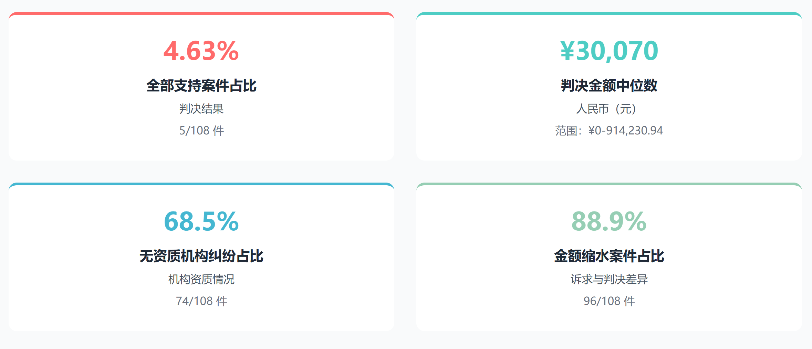

# 第一章 赢面小、金额少：医美维权的核心困境透视

百份裁判文书勾勒出的医美维权图景，核心关键词是 “赢面小（全额支持率不足 5%）、金额少（判决金额不足诉求 1/3）”。对于绝大多数遭遇医美事故的消费者而言，维权之路不仅漫长坎坷，最终能获得的赔偿也往往与预期相去甚远，陷入 “维权成本高、收益低” 的两难境地，不少人在中途选择放弃。

## 一、判决结果：超六成案件直接驳回，全额支持率不足 5%

从判决结果分布数据来看，医美维权的 “赢面” 堪称渺茫。在 108 起医美纠纷案件中，64.8% 的案件被法院直接驳回诉求，消费者颗粒无收；30.6% 的案件获得部分支持，仅 5 件案件（占比 4.63%）的消费者诉求被全部支持。这意味着，每 20 名医美维权者中，仅有 1 人能完全实现诉求，其余 19 人要么败诉，要么只能获得部分赔偿。

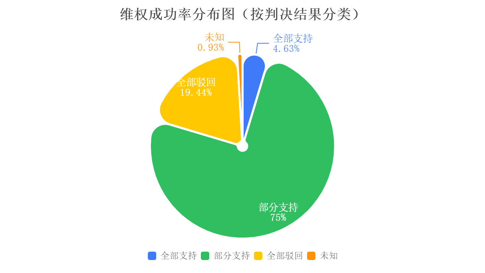

## 二、金额缩水：判决金额不足诉求 1/3，超八成案件收益微薄

如果说 “赢面小” 是维权者面临的第一道难关，那么 “金额缩水” 则是雪上加霜的第二重打击。统计数据显示，108 起案件的诉求金额平均数 24.93 万元、中位数 11.00 万元，而判决金额平均数 9.05 万元、中位数 3.01 万元，分别仅为诉求金额的 36.3%、27.4%；从比例来看，88.9% 的案件都出现了不同程度的金额缩水。

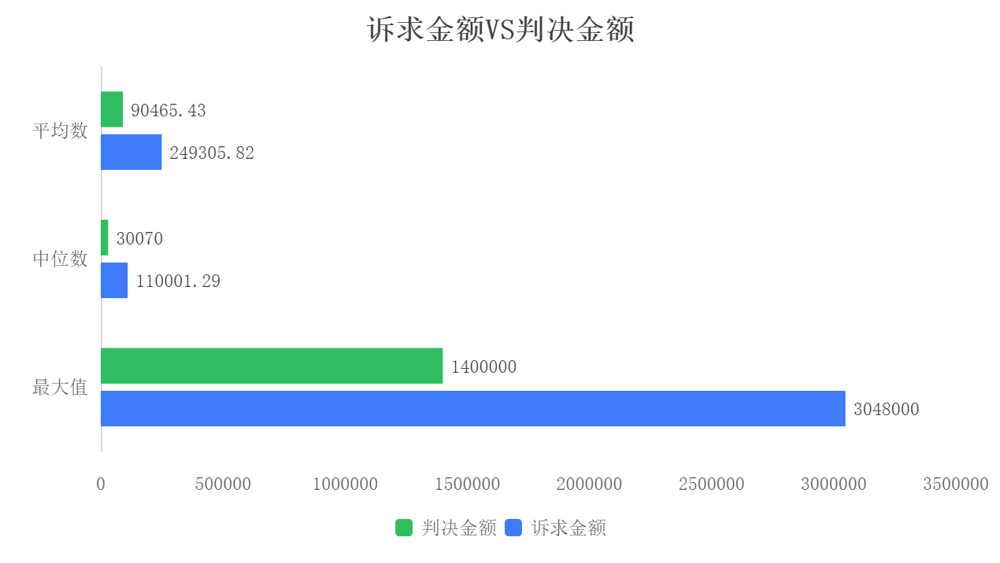

金额缩水的背后，是消费者实际损失与司法认定赔偿之间的巨大差距。辽宁一消费者接受无资质机构玻尿酸填充后出现静脉栓塞（玻尿酸注射常见严重并发症，指注射材料误入血管导致血液堵塞，可能引发皮肤坏死、失明等风险），构成十级伤残（我国伤残等级共 10 级，十级为最低级，对应日常活动能力轻度受限，如局部皮肤坏死导致外观缺陷、肢体轻微功能障碍），医疗费用、误工费用等实际损失超 15 万元，诉求 15.6 万元赔偿，最终仅获赔 12.1 万元；河南一消费者花费 3000 元进行双眼皮手术，术后眼睑塌陷（指眼睑组织凹陷，导致眼部外观畸形，可能影响视野或眼部功能）构成十级伤残，后续修复费用超 8 万元，诉求 10 万元赔偿，最终仅获赔 11.4 万元（含伤残赔偿金）。即便获得部分赔偿，扣除维权过程中的各项开支后，消费者的实际收益也所剩无几。

## 三、成本高：维权开支吞噬微薄赔偿，陷入 “得不偿失” 困境

医美维权的高成本，进一步放大了 “收益低” 的困境。据梳理，医美维权案件中，消费者需承担的成本包括案件受理费、律师费、司法鉴定费、差旅费等多项开支。其中，案件受理费根据诉求金额而定，诉求 10 万元以下的案件受理费通常在 2000 元左右，诉求 50 万元以上的案件受理费则超过 1 万元；律师费普遍在 5000 元至 5 万元之间，复杂案件的律师费甚至更高；司法鉴定费（如医疗过错鉴定、伤残等级鉴定）通常在 8000 元至 2 万元之间，若涉及异地鉴定，还需额外支付差旅费。

对于最终仅获赔数万元的消费者而言，这些开支往往会吞噬大部分赔偿。某诉求 8 万元、最终获赔 3 万元的医美纠纷中，消费者支付的律师费 3000 元、案件受理费 1800 元、鉴定费 1.2 万元，各项开支合计 1.68 万元，扣除后实际获得的赔偿仅 1.32 万元，甚至不足以覆盖后续的修复费用。高成本、低收益的现实，让不少消费者在维权过程中望而却步，最终选择放弃维权，这也间接放任了部分医美机构的违规行为。

# 第二章 哪里维权最难？

医美维权面临的双重挑战，不仅体现在案件数量上，更隐含在法律博弈的复杂程度之中。

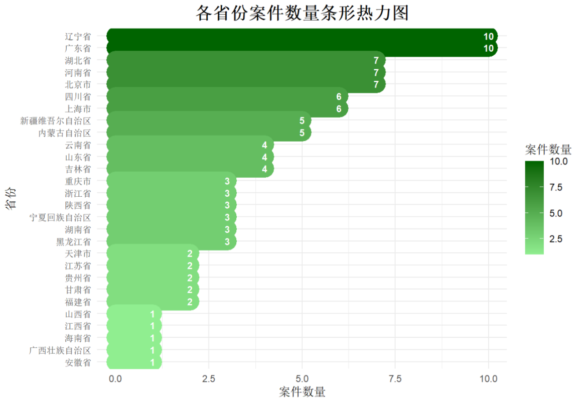

数据显示，医美纠纷在地域分布上呈现显著的 “东多西少” 特征 —— 华东、东北与华中地区是案件高发区域，仅华东一地就占总量的 17.59%，而西北地区占比不足 5%。具体到省份，辽宁与广东并列案件数量首位。这一分布格局，与各地区经济发展水平、医美市场渗透率及消费者维权意识高度契合。

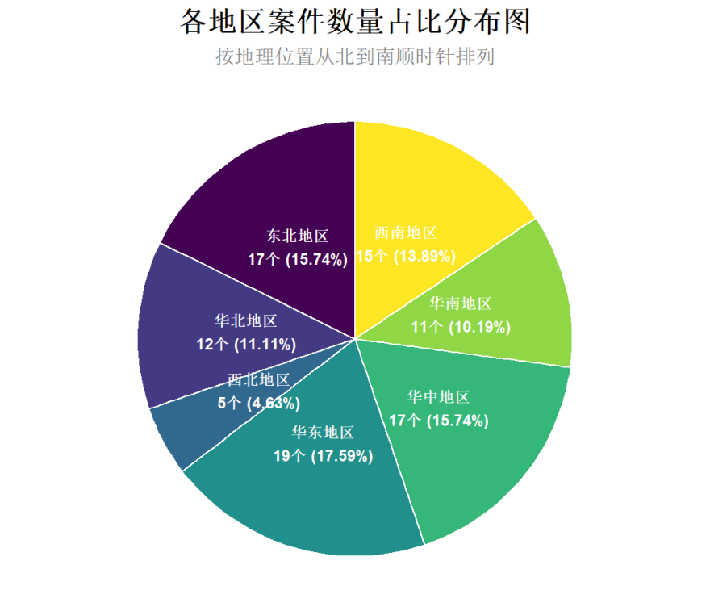

然而，更值得关注的发现是一个略显反直觉的现象：尽管涉诉主体中以 “无资质” 开展服务的机构或个人占绝大多数，但针对这类被告的案件，消费者诉求获得法院 “部分支持” 的比例却高达 76.9%，反而高于起诉 “有资质” 机构的情形。后者被 “全部驳回” 的比例相对更高。

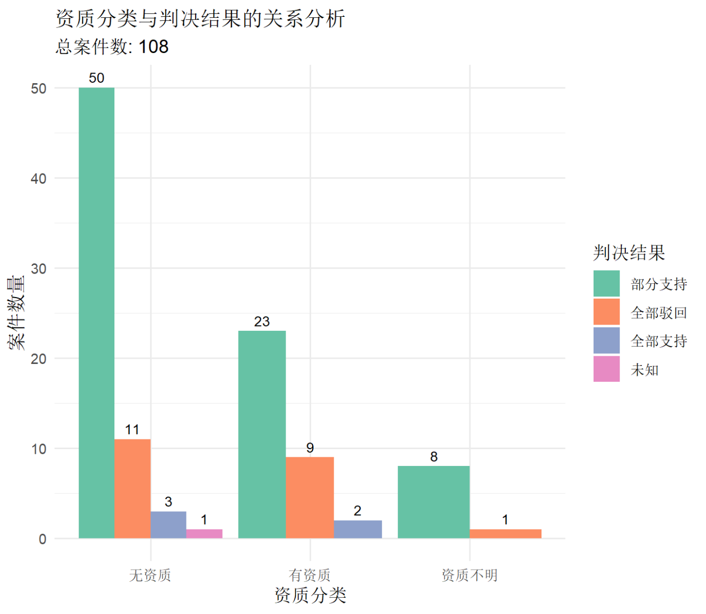

这种反差背后，实质上是法律定性及举证责任的差异所致。对于 “无资质” 提供服务的行为，法院可直接认定为《中华人民共和国消费者权益保护法》（以下简称《消费者权益保护法》）意义上的商业欺诈（指经营者故意隐瞒真实情况或虚构事实，诱使消费者作出错误选择的行为，如隐瞒无资质、用 “三无产品” 冒充合规产品），因其直接违反了《医疗美容服务管理办法》等国家强制性规定。一旦定性为欺诈，便可适用《消费者权益保护法》中 “退一赔三”（该法第 55 条规定，经营者欺诈消费者的，需返还消费者支付的费用，并额外赔偿三倍费用，需满足 “故意欺诈” 的核心前提）的惩罚性赔偿（指超出实际损失的赔偿，目的是惩罚违法行为、遏制同类行为再次发生）条款，消费者的退款与赔偿诉求因而更容易获得支持。相比之下，与 “有资质” 机构发生的纠纷，多被归为医疗损害责任纠纷（指医疗机构或医务人员因医疗过错，导致患者人身损害，需承担侵权责任的纠纷，举证核心是 “机构有过错、消费者有损害、过错与损害存在直接因果关系” 三要件）或合同违约，争议焦点往往在于 “效果未达预期” 或 “存在操作瑕疵”。在此类案件中，消费者需要承担更重的举证责任（指法律规定由当事人承担的提供证据证明自己主张的义务，若无法提供充分证据，可能承担败诉后果），须通过专业鉴定等方式证明机构存在过错、损害后果及其因果关系，举证门槛高、难度大，因此败诉或仅获部分支持的风险也相应增加。

由此可见，维权难度不能仅凭案件数量简单衡量。在案件稀疏的地区，可能映射出维权通道不畅或意识薄弱；而在纠纷频发的区域，面对 “有资质” 机构时，因涉及专业判断与复杂举证，实际维权成本与不确定性反而可能更高。与此形成对比的是，针对 “无资质” 的 “黑医美”，法律提供了更为明确和严厉的规制工具，使得维权路径反而更加清晰有力。

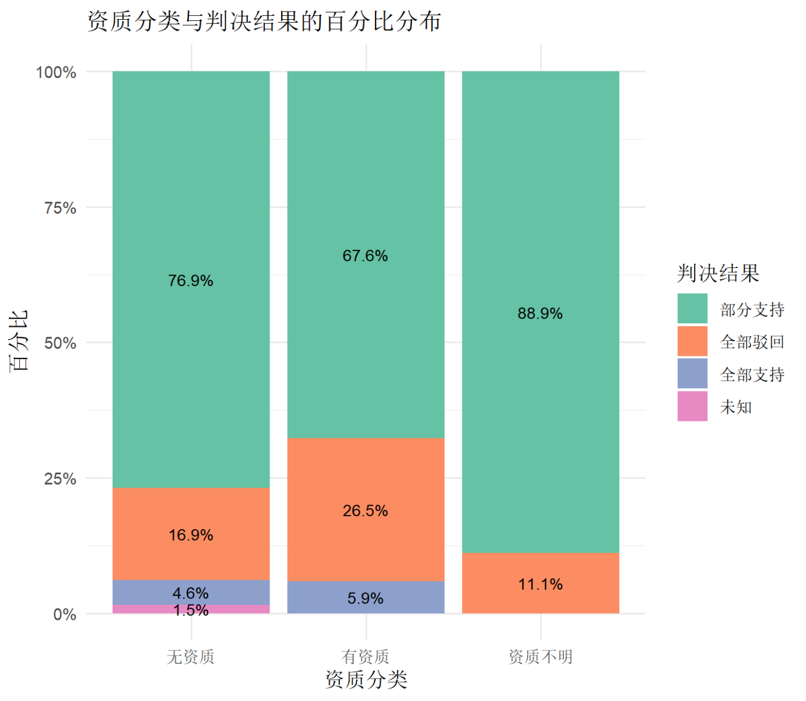

# 第三章 哪些项目最危险？高危项目与纠纷原因

在医美消费热潮下，光鲜亮丽的效果背后暗藏着不少风险。数据分析显示，手术类项目是纠纷绝对重灾区，而 “效果不符预期”“术后感染”“机构无资质经营” 成为引发纠纷的三大核心原因，62.1% 的纠纷集中在玻尿酸注射、双眼皮手术、隆胸等热门项目中，普通消费者需重点警惕。此外，两类特殊场景的风险需额外关注：一是 “修复类” 项目，纠纷占比达 23.1%，因术前基础条件差、修复难度高，效果不确定性更大；二是跨境医美，因管辖权认定难、鉴定标准不一致，维权成本远高于境内消费。

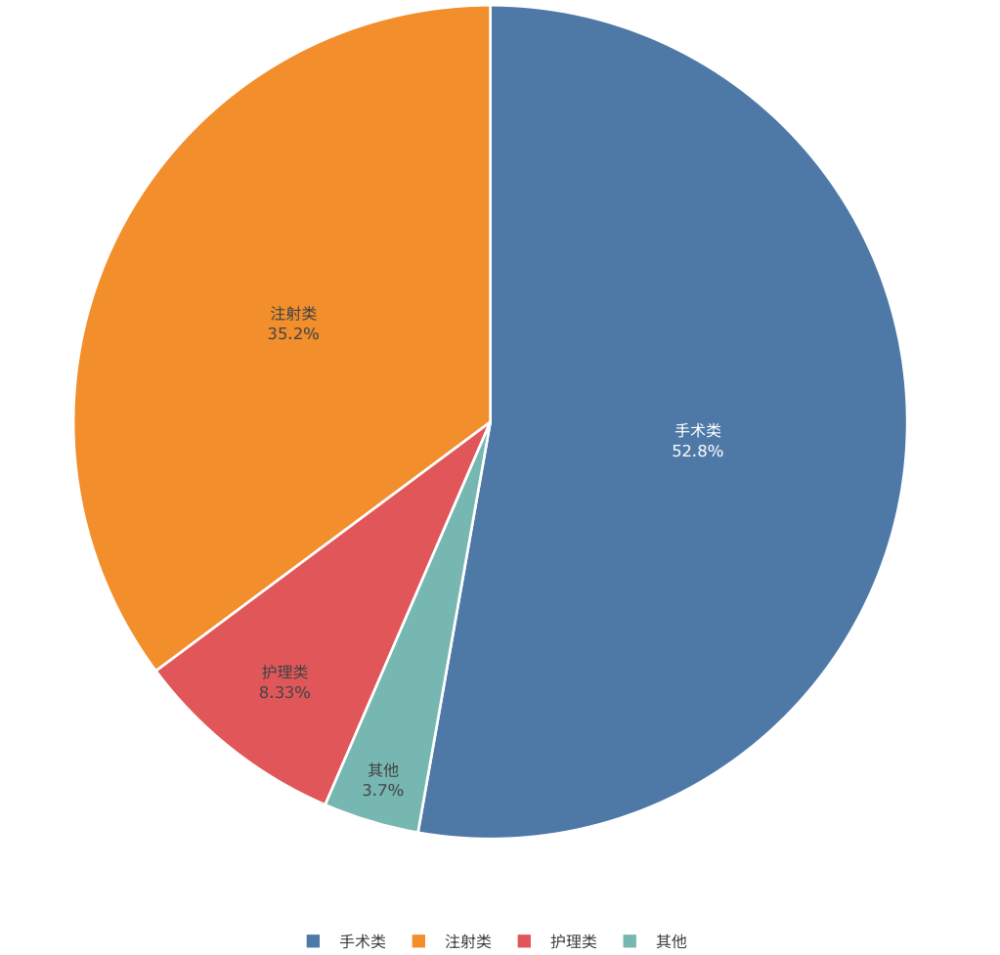

从一级服务类型的纠纷分布来看，手术类项目的纠纷占比高达 52.8%，远超其他类型，且平均诉求金额 8.6 万元，是所有服务类型中最高的。这一数据印证了手术类项目因侵入性强、操作复杂度高，风险系数显著高于其他项目。注射类项目紧随其后，纠纷占比 35.2%，平均诉求金额 6.3 万元，虽低于手术类，但因涉及产品质量、注射剂量等多重变量，纠纷发生率同样居高不下。相比之下，护理类和其他非侵入性项目的纠纷占比仅为 8.3% 和 3.7%，平均诉求金额也不足 3 万元，风险相对较低。

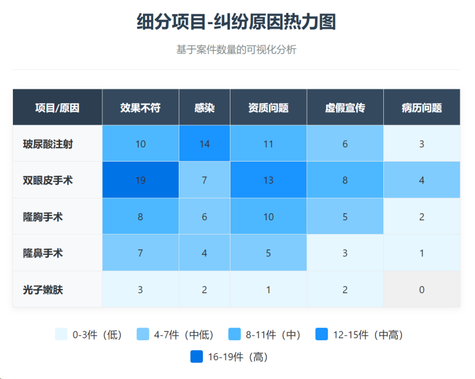

细分到具体项目，玻尿酸注射、双眼皮手术、隆胸手术成为纠纷最为集中的高危项目。玻尿酸注射的纠纷中，38.6% 源于感染并发症，27.3% 涉及效果未达预期，典型案例中，辽宁一消费者接受无资质机构的玻尿酸填充后出现静脉栓塞（玻尿酸注射常见严重并发症，指注射材料误入血管导致血液堵塞，可能引发皮肤坏死、失明等风险），构成十级伤残（我国伤残等级共 10 级，十级为最低级，对应日常活动能力轻度受限），虽胜诉但诉求 15.6 万元仅获赔 12.1 万元。双眼皮手术的纠纷核心则是效果争议，42% 的案件（双眼皮手术纠纷中）涉及术后不对称、疤痕明显等问题，河南一消费者花费 3000 元进行双眼皮手术，术后眼睑塌陷（指眼睑组织凹陷，导致眼部外观畸形）构成十级伤残，最终仅获赔 11.4 万元。隆胸手术的纠纷不仅诉求金额高（平均诉求金额 12.8 万元），且多与资质问题挂钩，超四成案件的涉事机构无医疗美容资质，重庆一消费者在酒店接受无资质人员的注射隆胸后，出现假体移位（指植入的假体偏离预设位置，导致外观畸形、疼痛）、乳腺增生等问题，诉求 20.5 万元仅获赔 10.5 万元。

纠纷原因的关键词统计更直观呈现了风险焦点：“效果不符” 以 35.2% 的占比位居第一，“无资质”“感染” 分别以 31.5% 和 28.7% 紧随其后，“虚假宣传”“违规操作” 的占比也均超过 15%。这些关键词直指行业合规短板与消费者认知误区：部分机构为逐利隐瞒无资质事实，使用 “三无产品” 或在非正规场所开展服务；消费者则因对效果预期过高、术前未核实资质，进一步推高纠纷风险。

对于普通消费者而言，避坑需抓住三个核心：一是查资质，选择持有《医疗机构执业许可证》的机构，核实医生的《医师执业证书》及美容主诊医师资格，拒绝个人工作室、酒店手术等非正规服务；若选择跨境医美，需提前留存机构资质公证文件、明确管辖权约定，优先选择与境内有合作的正规机构；二是留证据，术前确认产品备案信息并拍照留存，签订详细服务合同，术后记录恢复情况；三是理性预期，尤其是修复类项目，需提前与医生明确效果边界，避免被 “完美修复”“零风险” 等虚假宣传误导。医美维权的本质是对合规的倒逼，唯有消费者谨慎选择、行业规范经营，才能让医美消费真正回归 “美丽与安全并存” 的初衷。

# 第四章 维权成功的关键：证据、资质与鉴定的三重破局

医美维权并非绝境，这些裁判文书通过数据勾勒出清晰的胜诉路径：抓住 “证据链完整、锁定资质缺陷、精准提交鉴定报告” 三大核心，能显著降低维权难度、提高诉求支持率。同时需警惕：消费者自身过错可能成为维权绊脚石，部分案件因消费者存在不当行为导致诉求未获支持。这一结论背后，是司法实践中对 “事实认定” 与 “法律适用” 的双重考量，也是消费者突破维权壁垒的关键逻辑。

## 证据链：核心证据的 “有效性密码”

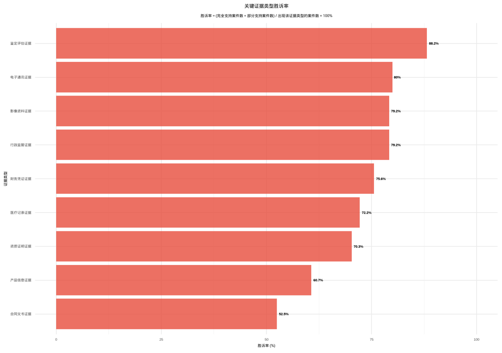

数据显示，不同类型证据的支持率差异显著 —— 微信聊天记录因获取便捷，使用率达 58.3%，38.1% 的诉求支持率显著高于缴费凭证（20%）；而鉴定评估证据虽使用率仅 1.9%，但胜诉率高达 88.2%，是核心胜诉证据。需特别说明的是，鉴定报告的支持率呈现 “两极分化”：明确指向 “医美行为与损害存在直接因果关系” 的鉴定报告支持率高达 89.7%，但未明确因果关系的报告支持率为 0%，这也解释了低使用率下的特殊支持率现象。

微信聊天记录的高支持率，源于其能直接固定 “双方约定、效果承诺、沟通过程” 等关键事实。广东隆鼻案便是典型：消费者完整留存了与机构的微信聊天记录（明确记载 “隆鼻后自然挺拔、无疤痕” 的承诺）、术前术后对比照片（术后鼻梁明显歪斜）、加盖机构公章的缴费凭证，形成完整证据链。尽管未提交鉴定报告，但法院结合证据链认定 “机构未履行效果承诺，存在违约”，最终支持 4.5 万元赔偿（诉求 14.3 万元）。

反观支持率较低的缴费凭证，核心问题在于 “孤立无援”——6 件涉及缴费凭证的案件中，4 件因未与服务合同、项目清单对应，无法证明费用与涉诉医美行为的关联性，最终未获支持。这提示消费者：证据的核心价值在于 “形成闭环”，单一证据的证明力有限，需通过多重证据相互印证。

## 鉴定报告：因果关系的 “核心背书”

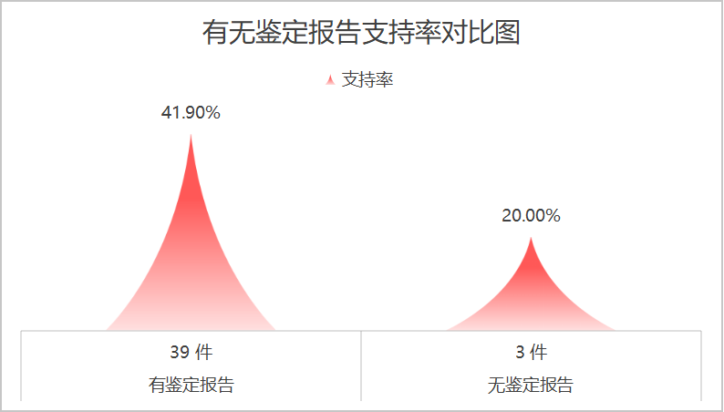

有无鉴定报告支持率对比数据极具说服力：有鉴定报告支撑的案件支持率达 41.9%（93 件样本），而无鉴定报告的案件支持率仅 20.0%（15 件样本），21.9 个百分点的差距，凸显了专业技术证据在医美维权中的 “决定性作用”。但需注意，鉴定报告的有效性关键在于 “明确因果关系”—— 部分消费者仅提交伤残等级鉴定，未证明伤残与医美行为的关联，最终因 “因果关系不明” 导致诉求被驳回。

辽宁玻尿酸栓塞案印证了精准鉴定的重要性：消费者术后出现静脉栓塞（玻尿酸注射常见严重并发症），构成十级伤残（我国伤残等级共 10 级，十级为最低级），其委托具备资质的鉴定机构出具《司法鉴定意见书》，明确 “涉事机构的注射操作不当是导致静脉栓塞的直接原因，机构存在主要过错”。尽管诉求 15.6 万元未被全额支持，但凭借该鉴定报告，最终获赔 12.1 万元，支持率达 77.6%。反之，某隆胸纠纷中，消费者仅提交了伤残等级鉴定，未证明伤残与注射行为的关联，法院以 “因果关系不明” 为由驳回诉求，金额缩水 100%。

## 资质锁定：“黑医美” 的维权捷径

呼应第二章的核心发现，针对无资质机构的维权支持率（76.9%）远高于有资质机构，这一规律成为维权的 “重要捷径”。其底层逻辑是法律定性的差异：无资质机构的医美服务直接违反《医疗美容服务管理办法》等强制性规定，法院可直接认定为 “商业欺诈”（指经营者故意隐瞒无资质、使用三无产品等事实），适用《消费者权益保护法》“退一赔三”（需满足 “欺诈” 前提）条款，消费者的退款与赔偿诉求更易获得支持；而有资质机构的纠纷多归为医疗损害责任纠纷（需证明 “过错、损害、因果关系” 三要件），举证难度大幅增加。

浙江一消费者的经历颇具代表性：其在某个人工作室（无《医疗机构执业许可证》）接受双眼皮手术，术后出现眼睑外翻（指眼睑边缘向外翻卷，影响外观与功能），因提前核查并留存了该工作室无资质的证据（卫健委投诉回复、现场照片），法院直接认定构成欺诈，不仅支持全额退款，还判决 3 倍赔偿，最终诉求 8.2 万元全额获支持，成为 108 件案件中 5 件全额支持案件之一。

实践中，部分消费者因自身行为导致维权受阻，需重点规避：
- 术后未遵医嘱护理：如双眼皮术后未按要求冷敷热敷、抽脂后未穿塑身衣，导致恢复不佳，法院可能认定 “消费者自身过错减轻机构责任”，降低赔偿比例；
- 隐瞒关键病史：如糖尿病患者未告知机构，导致术后感染加重，可能影响因果关系认定，甚至部分诉求被驳回；
- 诉求金额虚高：如实际损失 5 万元却诉求 50 万元，且无法提供对应损失证据，可能因 “缺乏事实依据” 被驳回核心诉求。

结合数据与案例，消费者可遵循 “事前核查、事中留证、事后维权” 的实操路径，提高胜诉概率：
1. 事前锁定资质：通过国家卫健委官网核查机构《医疗机构执业许可证》（诊疗范围需包含医疗美容），核实医师的《医师执业证书》及美容主诊医师资格，拒绝个人工作室、酒店等非正规场所服务；跨境医美需额外留存机构资质公证文件，明确管辖权约定；
2. 事中留存闭环证据：签订详细服务合同（明确项目、效果、违约责任），拍照留存产品备案信息（药品、器械的批准文号），全程记录沟通内容（微信、短信等），术后定期拍摄恢复照片，若出现不适及时就医并留存病历；
3. 事后精准维权：优先申请 “医疗过错 + 因果关系 + 伤残等级” 三位一体的司法鉴定，锁定核心证据；若机构无资质，同步向卫健委投诉，行政查处记录可作为司法程序中的补充证据；诉求金额需结合实际损害（医疗费、误工费、伤残赔偿金等）合理主张，避免过高预期导致诉求被驳回。

## 合规为基，让 “美” 不再伴随风险

108 份医美纠纷裁判文书，既是维权者的血泪记录，也是行业合规的 “警示教材”。数据背后的核心矛盾，是消费者对 “安全美” 的诉求与行业部分机构 “重盈利、轻合规” 的乱象之间的失衡 ——68.5% 的纠纷涉及无资质机构，35.2% 的纠纷源于效果不符，28.7% 的纠纷与感染相关，这些数字反复提醒：医美消费的底线是安全，行业发展的根基是合规。

对于消费者而言，避坑需坚守 “数据支撑的三大核心原则”：
- 资质核查是第一道防线：针对无资质机构占比超六成的乱象，术前务必通过官方渠道核验机构与医师资质，拒绝 “无证服务”；跨境医美需额外关注资质公证与管辖权约定，从源头降低风险；
- 证据留存是维权底气：微信聊天记录 58.3% 的使用率和 38.1% 的支持率，证明了 “全程留证” 的重要性，术前合同、产品凭证、术后记录缺一不可，形成完整证据链；
- 专业鉴定是胜诉关键：41.9% 与 20.0% 的支持率对比，凸显了鉴定报告的核心价值，遭遇损害后及时申请 “因果关系 + 过错” 鉴定，同时规避自身过错（如遵医嘱护理、如实告知病史），是提高诉求支持率的关键。

医美维权的本质，不是 “对抗”，而是 “校准”—— 校准行业的合规方向，校准消费者的理性预期。当每一家机构都坚守合规底线，每一位消费者都秉持理性选择，医美行业才能真正摆脱 “纠纷阴影”，让 “美” 的追求不再伴随维权的艰难，让 “颜值升级” 真正回归 “安全与美丽并存” 的初心。

## 数据说明

本报告数据基于中国裁判文书网 2024 年 1 月 1 日 -2025 年 6 月 30 日公开的 108 份有效医美纠纷裁判文书（不含未公开案件）；有效裁判文书定义：已生效的民事判决书、调解书，排除驳回起诉、管辖权异议等程序性裁定；地域范围：不含港澳台地区，仅统计中国大陆省级行政区案件；案例中涉及的消费者姓名均为化名，相关隐私信息已做脱敏处理；数据因四舍五入可能存在微小误差，核心结论不受影响。
